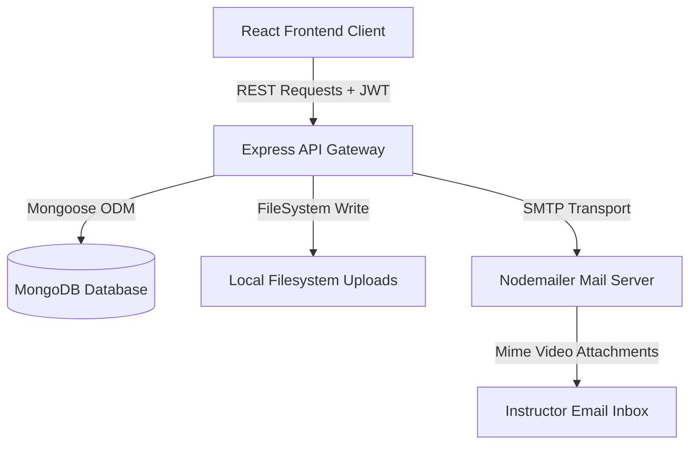

# ATS Assessment Suite

An advanced, proctor-secured assessment portal designed for academic testing and professional evaluations. The suite features a dual-interface architecture tailored for **Students** (test-takers) and **Teachers/Admins** (test-creators), backed by real-time automated proctoring (camera tracking and tab lockouts), robust performance analytics, and SMTP notifications.

---

## 🚀 Key Features

### 💻 Student Experience & Testing Sandbox
* **Dynamic Quiz Library**: Explore published tests, filter by subject tags, and keyword search quizzes.
* **Secured Testing Sandbox**: Take quizzes with an integrated countdown timer, visual warning logs, and dynamic choice selectors.
* **Practice Mode**: Unprotected tests permit practice runs where students can instantly verify their responses during the quiz.

### 🛡️ Automated Proctoring & Tab Lock System
* **Pre-Test Device Verification**: Interactive setup wizard validating camera access and screen-sharing permissions.
* **Webcam & Tab Guard**: 
  * Strict tracking of active tabs (blur detection) and fullscreen locks.
  * Attempting to minimize the browser, exit fullscreen, or switch tabs locks the assessment screen with a high-priority warning blocker.
* **Automated Video Logs**: Captures proctoring streams, compresses files, and automatically emails the base64 recording log directly to the quiz creator upon submission or early termination.

### 📊 Instructor Command Center & Analytics
* **Rich Dashboard**: At-a-glance telemetry tracking total users, published assessments, test attempts, average scores, and accuracy percentages.
* **Assessment Builder**: Complete editor to build multiple-choice questions, select difficulty tiers, set custom countdown limits, and toggle secure proctoring access.
* **Granular Reports**: Interactive accordion views showing individual student profiles, score progress bars, date timestamps, and access to proctoring records.

---

## 🧠 Engineering Highlights (Placement Showcase)

### 1. Overcoming the MongoDB 16MB BSON Document Limit
* **The Challenge**: Storing video streams directly inside MongoDB as base64 strings quickly exceeded the standard 16MB BSON document limit for any test lasting more than a few seconds. This led to fatal database exceptions and quiz submission failures.
* **The Architecture Solution**: Re-engineered the submission pipeline. The backend now decodes the incoming base64 streams, saves them as static `.webm` files on the server (`nodeapp/uploads/`), and stores a lightweight static path string in MongoDB.
* **The Result**: Result document sizes were reduced from megabytes to under 2KB. This secured the database, increased performance, and enabled static playback streaming via HTTP.

### 2. High-Performance Payload Handling
* Adjusted backend Express JSON parsers to process up to `200mb` payloads, allowing students to submit longer assessments with higher resolution proctoring feeds without experiencing `413 Payload Too Large` restrictions.

---

## 📂 Project Structure Directory Blueprint

```
ATS/
├── nodeapp/                 # Backend Node/Express Server
│   ├── controllers/         # Request handlers (auth, quiz, user logic)
│   ├── middleware/          # JWT tokens & role-based route guards
│   ├── models/              # Mongoose/MongoDB Schemas (User, Quiz, Result)
│   ├── routes/              # Express Router mapping to API endpoints
│   ├── uploads/             # Server file storage for decoded proctoring videos
│   ├── index.js             # Main server entrypoint (CORS, body-parsers)
│   └── package.json
│
└── reactapp/
    └── frontend/            # Client Frontend React Application
        ├── public/
        ├── src/
        │   ├── api/         # Axios instance setup with auth header interceptors
        │   ├── components/  # Core widgets (Layout, Auth login/register, Quiz builders)
        │   ├── context/     # Global state provider for user sessions
        │   ├── pages/       # View pages (Dashboard, Profile, NotFound)
        │   ├── styles/      # Component specific styling rules
        │   ├── App.jsx      # React router wrapper
        │   └── main.jsx
        ├── package.json
        └── vite.config.js
```

---

## 🛠️ Technology Stack

| Architecture Layer | Technology | Key Usage |
| :--- | :--- | :--- |
| **Frontend** | React (Vite) | Component-driven, responsive UI engine. |
| **Routing** | React Router | Declarative client-side routing. |
| **Styling** | Vanilla CSS | Custom design system using glassmorphism, Outfit/Jakarta typography, and orbit rotation keyframes. |
| **Icons** | React Icons (FontAwesome) | Visual indicators and control system hooks. |
| **Backend** | Node.js / Express | REST API server handling user authentication, quiz creation, and report generation. |
| **Database** | MongoDB / Mongoose | Schema validation and storage for user states, assessments, and reports. |
| **Email Logs** | Nodemailer / SMTP | Dynamic attachment processing to email proctoring reports to instructors. |

---

## 📈 System Architecture



---

## ⚙️ Installation & Setup

### Prerequisites
* [Node.js](https://nodejs.org/) (v16+)
* [MongoDB Atlas](https://www.mongodb.com/cloud/atlas) or local MongoDB instance

### 1. Repository Installation
Clone the repository and enter the directory:
```bash
git clone https://github.com/THIRUMULANATHAN/ATS.git
cd ATS
```

### 2. Backend Configuration (`nodeapp`)
Navigate to the backend folder, install dependencies, and create an `.env` file:
```bash
cd nodeapp
npm install
```

Create a `.env` file inside `nodeapp/`:
```env
PORT=8080
MONGO_URI=your_mongodb_connection_string
JWT_SECRET=your_jwt_secret_key
SMTP_HOST=smtp.gmail.com
SMTP_PORT=587
SMTP_USER=your_email@gmail.com
SMTP_PASS=your_app_password
```

Start the backend development server:
```bash
npm run dev
```

### 3. Frontend Configuration (`reactapp/frontend`)
Navigate to the frontend folder, install dependencies:
```bash
cd ../reactapp/frontend
npm install
```

Start the Vite development server:
```bash
npm run dev
```
Open [http://localhost:5174](http://localhost:5174) (or the dynamically shifted port shown in terminal output) to explore.

---

## 🔌 API Reference Endpoints

### 🔐 Authentication
* `POST /api/auth/register` - Create student, teacher, or admin accounts.
* `POST /api/auth/login` - Verify credentials and return active user profile payloads.

### 📝 Quizzes
* `GET /api/quizzes` - Retrieve all available quizzes.
* `POST /api/quizzes` - Publish a new quiz (Teacher/Admin restricted).
* `DELETE /api/quizzes/:id` - Remove a quiz from the library.
* `POST /api/quizzes/:id/submit` - Process test submissions and generate reports.

### 👥 Users & Telemetry
* `GET /api/users` - List all registered user profiles (Admin restricted).
* `GET /api/users/stats` - Fetch attempted quiz stats, average score, and accuracy metrics for the authenticated student.
* `GET /api/quizzes/reports` - Retrieve assessment attempts.

---

## 🛡️ Proctoring Lifecycle Flow

```
[Start Protected Quiz]
        │
        ▼
[Request Camera & Fullscreen Access]
        │
        ├─► User Rejects: Block entry.
        └─► User Grants: Start MediaRecorder recording logs & Lock Fullscreen.
        │
        ▼
[Active Assessment Sandbox]
        │
        ├─► User Exits Fullscreen: Freeze UI, Log Violation Warning.
        ├─► User Blurs Tab: Freeze UI, Trigger Blocker Modal.
        │
        ▼
[Quiz Submission / Timer Expiry]
        │
        ▼
[Stop Media Stream] ──► [Convert Blob to Base64] ──► [Save Decoded .webm on Server] ──► [Email Reports]
```

---

## 🤝 Connect & Inquire

Built for professional placement evaluations and recruitment verification.

* **Author**: Thirumulanathan
* **Email**: [thiru2005v@gmail.com](mailto:thiru2005v@gmail.com)
* **GitHub**: [github.com/THIRUMULANATHAN](https://github.com/THIRUMULANATHAN)
* **LinkedIn**: [linkedin.com/in/thirumulanathan](https://www.linkedin.com/in/thirumulanathan/)
