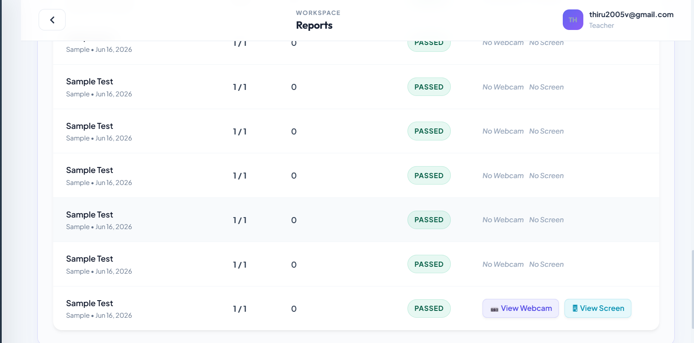
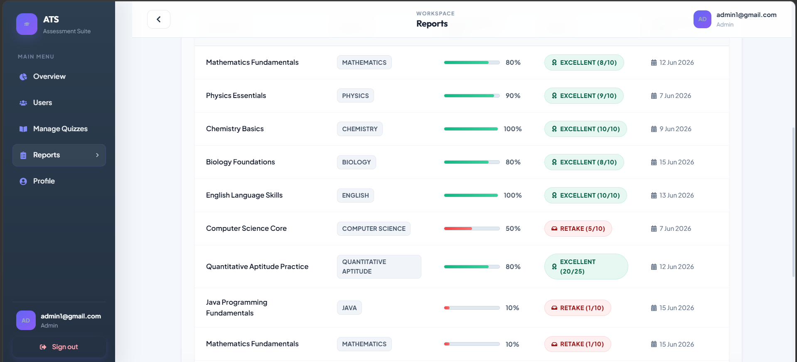
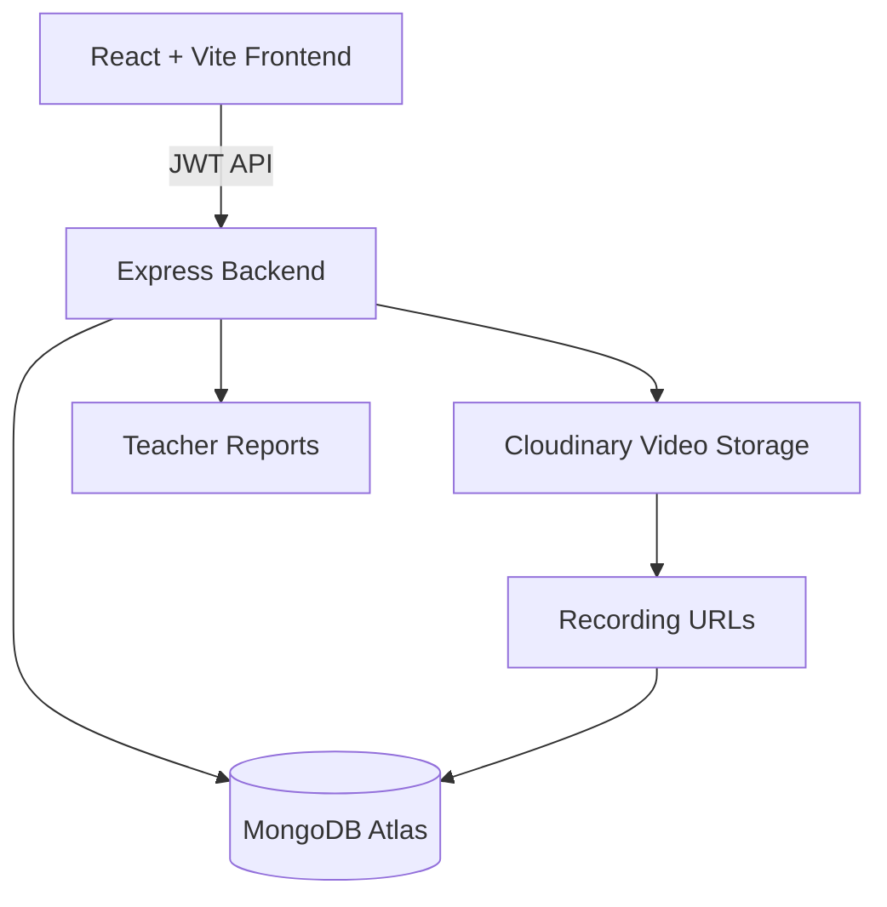

# 🛡️ ATS - Assessment & Test System

<div align="center">

### Advanced Online Examination Platform with Cloud Proctoring

A full-stack MERN assessment portal featuring secure online exams, webcam monitoring, screen recording, tab-switch detection, violation tracking, Cloudinary video storage, analytics dashboard, and automated teacher proctor reports.

<br/>

🚀 **Live Demo:**  
https://assessment-and-test-system.vercel.app/

</div>

---

## 📸 Application Preview


### Authentication


---

### Dashboard


---

### Quiz Library


---

### Protected Assessment Mode


---

### Webcam + Screen Recording


---

### Violation Warning System


---

### Proctor Reports






---

### Teacher Quiz Management


---


# 🚀 Features


## 👨‍🎓 Student Module

- Secure JWT authentication
- Browse quiz library
- Practice assessments
- Protected assessments
- Timer based exams
- Real-time score calculation
- Performance dashboard


---


# 🛡️ Cloud Proctoring System


ATS implements browser-based exam monitoring.


## Security Features


✔ Webcam access verification  
✔ Screen sharing validation  
✔ Fullscreen monitoring  
✔ Tab switch detection  
✔ Window focus tracking  
✔ Automatic violation counting  
✔ Teacher report generation  


---


# 🎥 Recording Architecture


Old approach:

❌ Base64 videos stored directly in MongoDB


Problem:

- MongoDB document size increased
- 16MB BSON limit issues
- Slow report loading


---


## New Cloudinary Architecture


```text

Student Exam
      |
      |
MediaRecorder API
      |
      |
WEBM Blob
      |
      |
Base64 Transfer
      |
      |
Express Backend
      |
      |
Cloudinary Upload
      |
      |
Secure Video URL
      |
      |
MongoDB Result Document
      |
      |
Teacher Report Dashboard

```


### Result


🔥 No MongoDB storage overload  
🔥 Unlimited scalable video storage  
🔥 Fast report loading  
🔥 Secure Cloudinary playback links  


---


# 👨‍🏫 Teacher Module


Teachers can:


- Create MCQ assessments
- Select difficulty
- Configure duration
- Enable protected mode
- View student results
- Check violations
- Watch webcam recordings
- Watch screen recordings


---


# 📊 Analytics


Tracks:


- Total quizzes
- Student attempts
- Average score
- Accuracy
- Protected exam violations
- Recording evidence


---


# 🏗️ Architecture





---


# 🛠️ Tech Stack


| Layer | Technology |
|-|-|
| Frontend | React + Vite |
| Styling | CSS |
| Routing | React Router |
| API | Axios |
| Backend | Node.js + Express |
| Database | MongoDB Atlas |
| ORM | Mongoose |
| Auth | JWT |
| Recording | MediaRecorder API |
| Video Storage | Cloudinary |
| Deployment Frontend | Vercel |
| Deployment Backend | Render |


---


# 📂 Project Structure


```text

ATS

├── nodeapp
│   |
│   ├── config
│   │    └── cloudinary.js
│   |
│   ├── controllers
│   ├── models
│   ├── routes
│   └── index.js
│

├── reactapp
│
│   └── frontend
│
│       └── src
│
│          ├── api
│          ├── components
│          └── styles
│

├── screenshots

└── README.md


```


---


# ⚙️ Environment Variables


Backend `.env`


```env

PORT=8080

MONGO_URI=your_mongodb_url

JWT_SECRET=your_secret


CLOUDINARY_CLOUD_NAME=your_cloud_name

CLOUDINARY_API_KEY=your_key

CLOUDINARY_API_SECRET=your_secret


```


---


# 🚀 Installation


Clone:

```bash

git clone https://github.com/THIRUMULANATHAN/Assessment-and-Test-System.git

cd Assessment-and-Test-System

```


Backend:


```bash

cd nodeapp

npm install

npm start

```


Frontend:


```bash

cd reactapp/frontend

npm install

npm run dev

```


---


# 🔌 Main APIs


Authentication

```http

POST /api/auth/register

POST /api/auth/login

```


Quiz

```http

GET /api/quizzes

POST /api/quizzes

POST /api/quizzes/:id/submit

DELETE /api/quizzes/:id

```


Reports

```http

GET /api/quizzes/reports

GET /api/users/stats

```


---


# 🔮 Future Improvements


- AI suspicious behaviour detection
- Face recognition login
- Object detection during exams
- Question generation using AI
- Advanced analytics dashboard


---


# 👤 Developer


**Thirumulanathan V**

Full Stack Developer  

MERN Stack + Spring Boot


GitHub:  
https://github.com/THIRUMULANATHAN


LinkedIn:  
https://www.linkedin.com/in/thirumulanathan/


---


⭐ If this project helped you, consider starring the repository!
