# 🛡️ ATS - Assessment & Test System

<div align="center">

### Advanced AI-Ready Online Examination Platform with Automated Proctoring

A full-stack MERN assessment portal that enables secure online exams with webcam monitoring, tab-switch detection, automated violation tracking, analytics dashboards, and email-based proctoring reports.

<br/>

🚀 **Live Demo:**  
https://assessment-and-test-system.vercel.app/

</div>

---

## 📸 Application Preview

### Authentication System
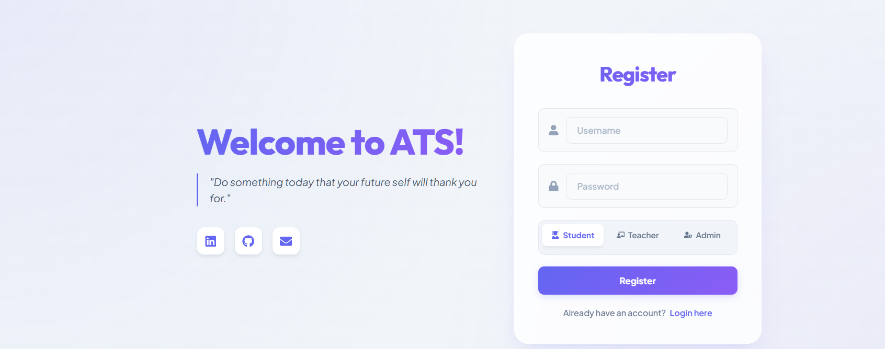

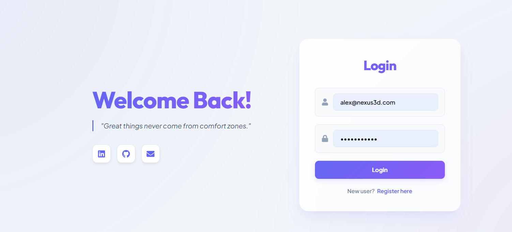

---

### Student Dashboard

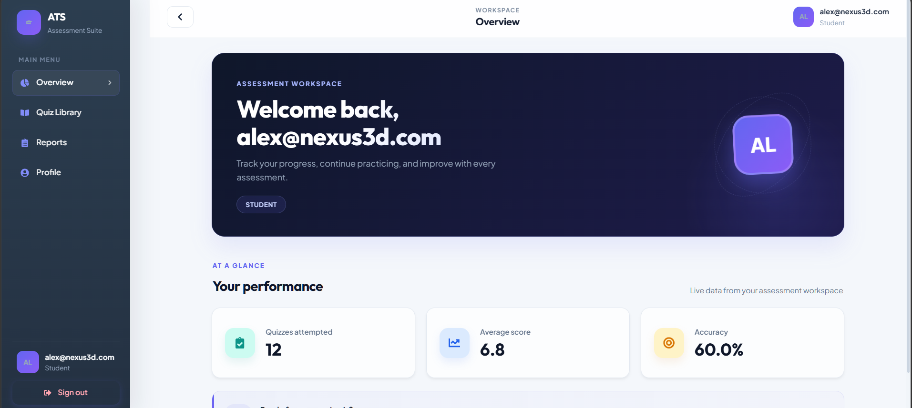

---

### Quiz Library

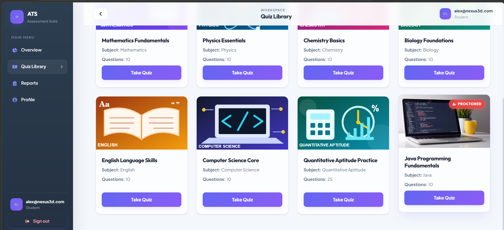

---

### Secure Proctored Assessment

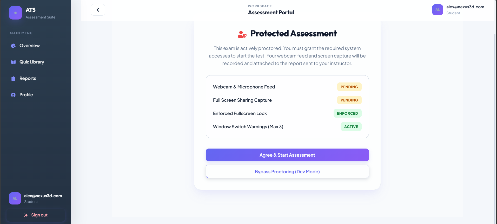

### Camera + Screen Monitoring

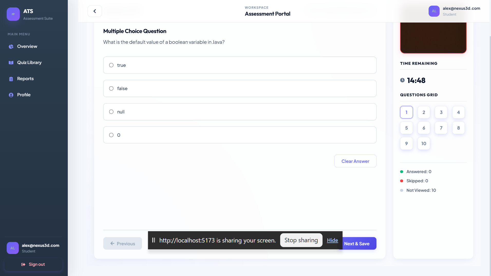

### Violation Detection

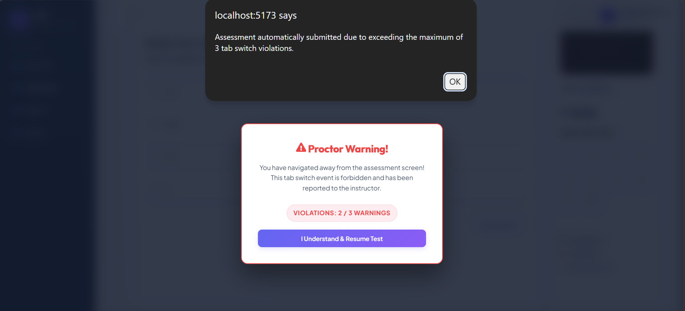

---

### Automated Email Reports

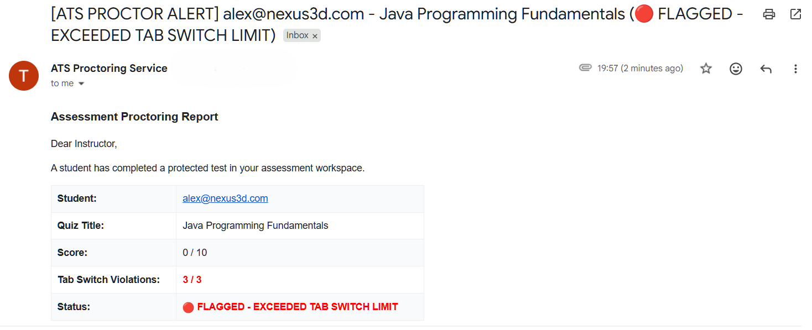

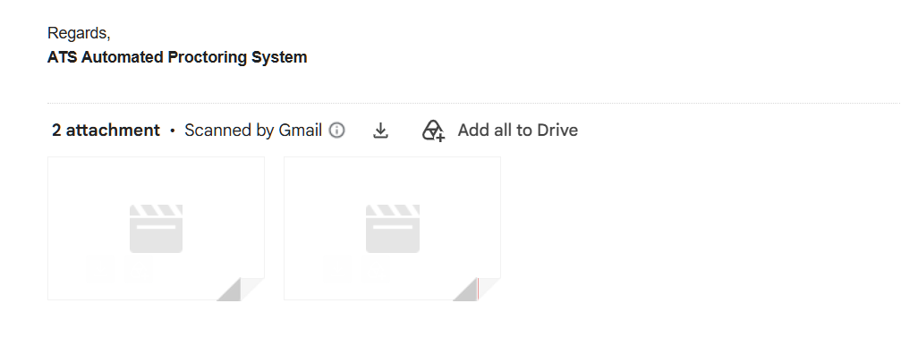

---

### Teacher Quiz Builder

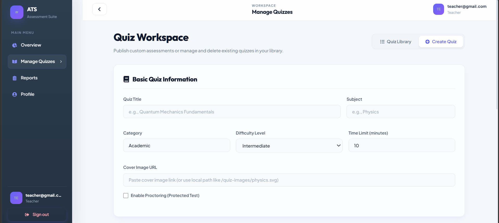


---

# 🚀 Features

## 👨‍🎓 Student Module

- Secure student authentication
- Browse available assessments
- Attempt quizzes with timer control
- Instant practice mode validation
- Score and accuracy tracking
- Personal performance dashboard


---

## 🛡️ Automated Proctoring System

The platform implements browser-level examination security.

### Security Checks

✔ Webcam permission validation  
✔ Screen monitoring initialization  
✔ Fullscreen enforcement  
✔ Browser tab switching detection  
✔ Window minimize detection  
✔ Violation warning system  


### Recording Workflow

```
Camera Stream
      ↓
MediaRecorder API
      ↓
Video Blob Generation
      ↓
Backend Processing
      ↓
WEBM Storage
      ↓
Email Delivery
```

---

# 👨‍🏫 Teacher/Admin Module

### Assessment Management

- Create MCQ assessments
- Configure:
  - Difficulty
  - Duration
  - Protected / Practice Mode
- Publish quizzes
- Remove assessments


### Analytics Dashboard

Tracks:

- Total users
- Total quizzes
- Attempts
- Average scores
- Accuracy percentage
- Student-wise reports


---

# 🧠 Major Engineering Problem Solved


## MongoDB 16MB BSON Limit Optimization


### Problem

Initially webcam recordings were stored directly as Base64 strings inside MongoDB.

This caused:

- Huge document sizes
- Database failures
- Slow queries
- BSON limit exceptions


### Solution Implemented

Redesigned storage architecture:

```
Frontend Recording
        |
        |
        V
Express Backend
        |
        |
 Decode Base64
        |
        |
 Save .webm File
        |
        |
 Store File URL in MongoDB
```

### Result

🔥 Reduced database documents from MB size to KB size  
🔥 Faster report loading  
🔥 Scalable proctoring storage  


---

# 🏗️ System Architecture


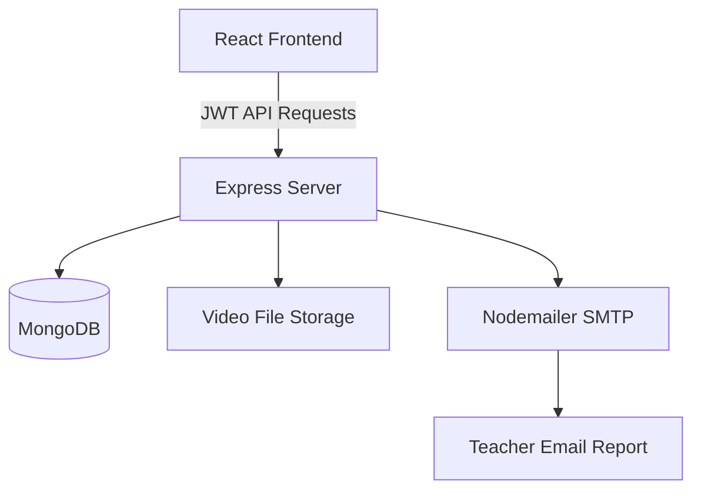

---

# 🛠️ Tech Stack


| Layer | Technology |
|-|-|
| Frontend | React + Vite |
| Styling | CSS3 |
| Routing | React Router |
| API Handling | Axios |
| Backend | Node.js + Express.js |
| Database | MongoDB + Mongoose |
| Authentication | JWT |
| Video Capture | MediaRecorder API |
| Email Service | Nodemailer SMTP |
| Deployment | Vercel |


---

# 📂 Folder Structure


```text
ATS
│
├── nodeapp
│   ├── controllers
│   ├── middleware
│   ├── models
│   ├── routes
│   ├── uploads
│   └── index.js
│
├── reactapp
│   └── frontend
│       ├── src
│       │   ├── api
│       │   ├── components
│       │   ├── context
│       │   └── pages
│       │
│       └── vite.config.js
│
├── screenshots
│
└── README.md
```

---

# ⚙️ Local Installation


Clone repository:

```bash
git clone https://github.com/THIRUMULANATHAN/Assessment-and-Test-System.git

cd Assessment-and-Test-System
```


## Backend Setup


```bash
cd nodeapp

npm install

npm run dev
```


Create `.env`:


```env
PORT=8080

MONGO_URI=your_database_url

JWT_SECRET=your_secret_key

SMTP_USER=your_email

SMTP_PASS=your_password
```


---

## Frontend Setup


```bash
cd reactapp/frontend

npm install

npm run dev
```


Application:

```
http://localhost:5173
```


---

# 🔌 API Modules


## Authentication

```
POST /api/auth/register

POST /api/auth/login
```


## Quiz

```
GET    /api/quizzes

POST   /api/quizzes

DELETE /api/quizzes/:id

POST   /api/quizzes/:id/submit
```


## Reports

```
GET /api/quizzes/reports

GET /api/users/stats
```


---

# 📌 Future Enhancements

- AI cheating behaviour analysis
- Face recognition verification
- Cloud video storage integration
- Advanced ranking analytics
- Question bank generation


---

# 👤 Developer

**Thirumulanathan V**

Full Stack Developer  
MERN + Spring Boot

📧 Email:  
thiru2005v@gmail.com

GitHub:  
https://github.com/THIRUMULANATHAN

LinkedIn:  
https://www.linkedin.com/in/thirumulanathan/


---

⭐ If you like this project, consider giving the repository a star!
